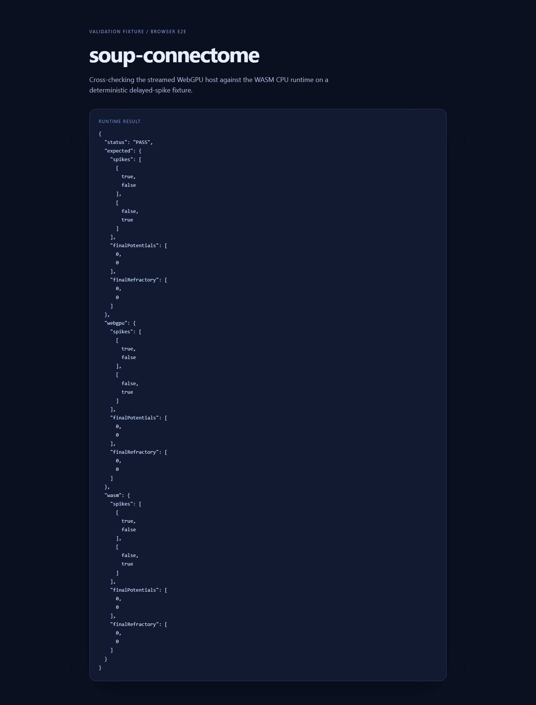

# Browser WebGPU host

This directory contains a dependency-free ES module for browser-side streamed
execution of `.scx` artifacts. It uses the same fixed-point WGSL kernels as the
Python WebGPU backend and keeps neuron state plus the delay line resident on the
`GPUDevice`; one validated source block is fetched and uploaded at a time.

## Validation result

The browser WebGPU ↔ WASM parity fixture passes in installed Chrome
`153.0.8010.37` with an Intel Gen-12LP adapter. The test compares delayed spike
trains and final state, not biological fidelity.



*Measured browser E2E result from the local Windows host.*

The host is intentionally a low-level runtime boundary, not a demo UI. A page
can use it like this:

```js
import { openArtifact, requestWebGPUDevice, runStreamed } from "./src/index.js";

const artifact = await openArtifact("/connectome/example.scx/");
const device = await requestWebGPUDevice();
const result = await runStreamed({
  device,
  artifact,
  config: {
    threshold: 20000,
    reset: 0,
    decay_shifts: [2],
    refractory_steps: 2,
  },
  timesteps: 4,
});
```

The same artifact can use the optional WASM CPU runtime. After loading the
`wasm-pack --target web` package and calling its default initializer, pass its
`ConnectomeRuntime` constructor to `runWasmStreamed`; the host sends each raw
block directly to WASM and retains no complete graph copy in JavaScript.

For a local browser E2E smoke test, build the wasm package and serve `web/`
from the repository root, then open `/test/e2e.html`:

```bash
cd web/wasm
wasm-pack build --target web --out-dir pkg --release
python -m http.server 8765 --directory ..
```

The page reports `PASS` only when browser WebGPU and WASM produce the same
delayed spike train and final state on the fixture.

The optional Playwright check uses a separate Chromium process and the same
page:

```bash
npm install
npx playwright install chromium
npm run test:e2e
```

To use an installed system browser explicitly, set
`SOUP_CONNECTOME_E2E_EXECUTABLE` to its executable path. The current Windows
host produced `PASS` in Chrome `153.0.8010.37` with an Intel Gen-12LP adapter:

```powershell
$env:SOUP_CONNECTOME_E2E_EXECUTABLE = "C:\Program Files\Google\Chrome\Application\chrome.exe"
npm run test:e2e:chrome
```

`npm test` runs parser and shader-contract tests in Node. The optional
`web/wasm` crate provides the WASM CPU streaming runtime; build it with
`wasm-pack build --target web --out-dir pkg --release` from that directory.
`npm run test:e2e` launches bundled Chromium against the page and fails on a
runtime mismatch; it skips only when Chromium cannot provide a WebGPU adapter.
`npm run test:e2e:chrome` launches the explicitly selected installed browser
and requires `PASS`. On this host the bundled headless Chromium reported no
adapter, while installed Chrome passed the fixture. The in-app browser still
returned a non-computing result. Browser fixture execution is therefore
`measured` for installed Chrome and `not tested` for the in-app-browser path.
Full-scale MaleCNS CPU/Python-WebGPU active stress is measured separately,
while active-edge multi-timestep browser throughput is `not tested`.
